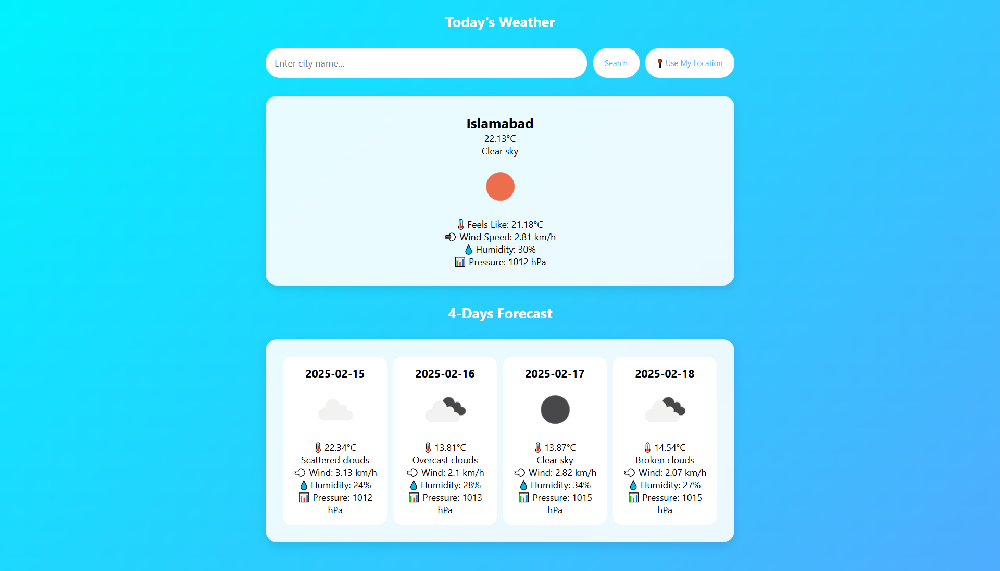

# 🌤️ Django Weather App

A simple Django-based weather application that fetches real-time weather data and a 4-day forecast using the **OpenWeather API**. The app allows users to search for weather conditions by **city name** or use their **current location**.



## 🚀 Features
✅ **Search by City** – Enter a city name to fetch weather data.  
✅ **Geolocation Support** – Get weather updates based on your current location.  
✅ **Real-Time Weather Data** – Displays temperature, humidity, wind speed, pressure, and weather conditions.  
✅ **4-Day Forecast** – Provides an upcoming weather forecast with icons and detailed conditions.  
✅ **Modern UI** – Responsive and clean design with CSS.  
✅ **Deployed on Vercel** – Accessible online via: **[Django Weather App](https://django-weather-app-gilt.vercel.app/)**.  

---

## 🛠️ Installation & Setup

### 1️⃣ Clone the Repository  
```bash
git clone https://github.com/aqibcs/django-weather-app.git
cd django-weather-app
```

### 2️⃣ Create a Virtual Environment  
```bash
python -m venv venv
source venv/bin/activate  # On Windows use: venv\Scripts\activate
```

### 3️⃣ Install Dependencies  
```bash
pip install -r requirements.txt
```

### 4️⃣ Set Up Environment Variables  
Create a `.env` file in the project root and add:  
```
OPENWEATHER_API_KEY=your_openweather_api_key
DJANGO_SECRET_KEY=your_django_secret_key
DEBUG=True
ALLOWED_HOSTS=127.0.0.1,localhost
POSTGRES_DB=your_db_name
POSTGRES_USER=your_db_user
POSTGRES_PASSWORD=your_db_password
DB_HOST=your_db_host
PGPORT=your_db_port
```

### 5️⃣ Apply Migrations  
```bash
python manage.py migrate
```

### 6️⃣ Run the Development Server  
```bash
python manage.py runserver
```  
Access the app at **http://127.0.0.1:8000/**  

---

## 🚀 Deployment on Vercel  
1. Install Vercel CLI:  
   ```bash
   npm install -g vercel
   ```
2. Log in to Vercel:  
   ```bash
   vercel login
   ```
3. Deploy the App:  
   ```bash
   vercel
   ```

---

### 👨‍💻 Developed by **Aqib Shah**
